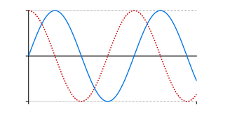
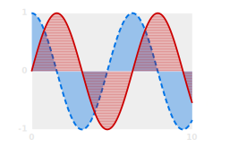
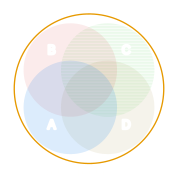
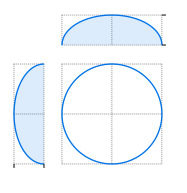

# Basic C++ plots

This is a minimal header-only and dependency-free C++ plotting library.

It's maintained mostly for internal Signalsmith Audio use, so I'm adding features as I need them.



## Design choices

* SVG output only
* auto-styled lines and fills
	* simultaneous colour/dash/hatch/marker sequences for accessibility
	* styling done via (customisable) CSS where possible
	* custom JS (included as source or URL)
* explicit labelling on lines, or legends
* values labelled with three levels: major/minor/tick
	* no explicit axis-lines, use major gridlines instead
* simplifies paths
	* attempts not to draw out-of-view data
	* drops points along almost-straight lines
* each plot's edge can have multiple partial axes
* basic grid (each row/column stretches to contain its contents)
* animated graphs with `<animate>` (SMIL)

### Limitations

* only 2D plots supported
* no automatic label placement or de-collision
* text lengths are heuristically estimated

## How to use

All you need is [the header file](plot.h):

```cpp
#include "plot.h";
```

View the [API docs](https://signalsmith-audio.co.uk/code/plot/html/group___plots.html) for complete info. 

### Basic example: drawing lines

Here's a minimal example, which sets up a 2D plot, adds some grid-lines/ticks:
```cpp
// Set up a plot
signalsmith::plot::Plot2D plot;

// Place the grid/ticks
plot.x.majors(0, 10).tick(5).minor(3.5);
ploy.y.major(0);

// If you don't set the scale, it will guess from data/ticks
plot.x.linear(0, 15);
// You can use custom scales, using any function
// (or lambda) which accepts/returns `double`
plot.y.range(std::log, 1, 1000);

// Set up a line
auto &line = plot.line();
for (auto &p : points) {
	// Add points as x/y pairs
	line.add(p.x, p.y);
}
// or from array (using `.size()` if not specified)
line.addArray(xArr, yArr);

plot.write("example.svg");
```

### More examples

See [examples.cpp](doc/examples.cpp) for code examples.  Here are the images generated by that code:










### API principles

You create a top-level object, which could be a `Figure` or a `Plot2D`:
```cpp
signalsmith::plot::Plot2D plot;
```

When you create a sub-object (line, sub-plot, etc.), you are returned a reference.  These elements are deliberately not copyable, so if you use `auto` instead of `auto &` it will complain.
```cpp
auto &line = plot.line();
```

Many methods return a reference to the object, allowing you to chain them together, e.g.:
```cpp
plot.x.major(0, 10).minor(5);
```

### Heat maps

There's an [additional module](file:///Users/geraint/Development/plot/doc/html/group___heat-_map.html) in `heatmap.h` for pixel-based heat-maps:


The colour map can be overridden by `#define`ing `SIGNALSMITH_HEATMAP_RGB` (before including `heatmap.h`), which should be the name of a function which accepts `(double v, uint8_t *rgb)` for v in 0-1.

## Development

### Testing

There aren't any unit tests, just a visual check of the example plots.

### License

Released as [0BSD](LICENSE.txt).  If you need anything else, get in touch. 🙂
